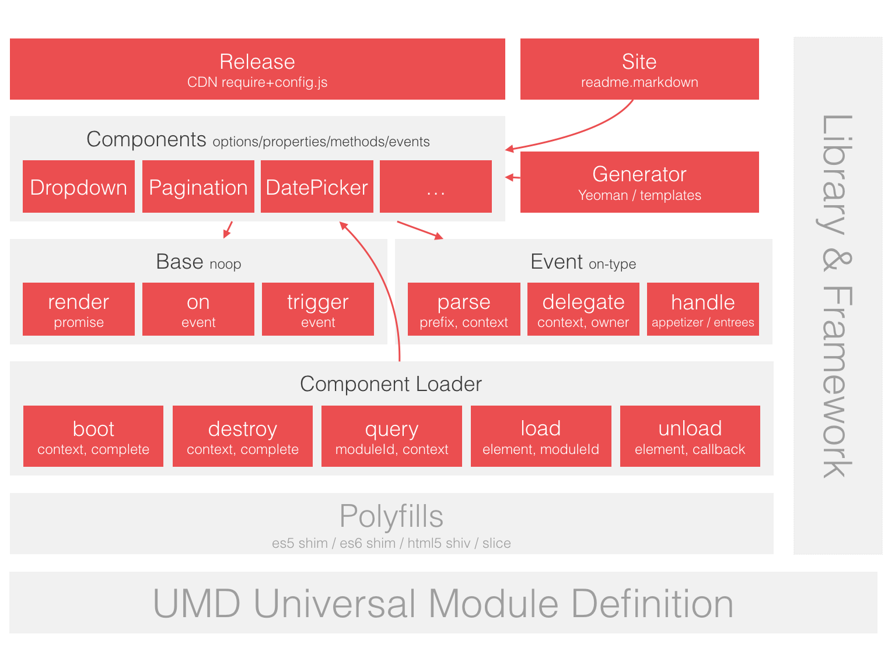

# Brix

像使用原生元素一样使用组件。
<!-- Introduction -->

## 快速开始

1. 引入 Brix

    ```html
    <script src="//g.alicdn.com/thx/brix-release/1.0.0-alpha.2/require-config-css.js"></script>
    ```


2. 配置 `bx-name`

    ```html
    <select bx-name="components/dropdown">
        <option>foo</option>
        <option>bar</option>
        <option>faz</option>
    </select>
    ```


3. 执行 `Loader.boot()`

    ```js
    var Loader = require('brix/loader')
    Loader.boot()
    // 或者
    require(['brix/loader'], function(Loader){
        Loader.boot()
    })
    ```


**运行结果：**

<iframe width="100%" height="300" src="//jsfiddle.net/nuysoft/tu86eozp/2/embedded/" allowfullscreen="allowfullscreen" frameborder="0"></iframe>

## 模块化的 Brix

Brix 由 Loader、Base、Event、Components 组成。

模块       | 说明
---------- | -------------
Loader     | 组件加载器，负责管理 Components 的整个生命周期，包括加载、初始化、渲染和销毁。
Base       | 组件基类。
Event      | 支持 bx-type 风格的事件模型，实现事件与 DOM 结构的松耦合，提升可读性、可复用性和可测试性。
Components | 一些可复用的组件。

## Brix 架构图
